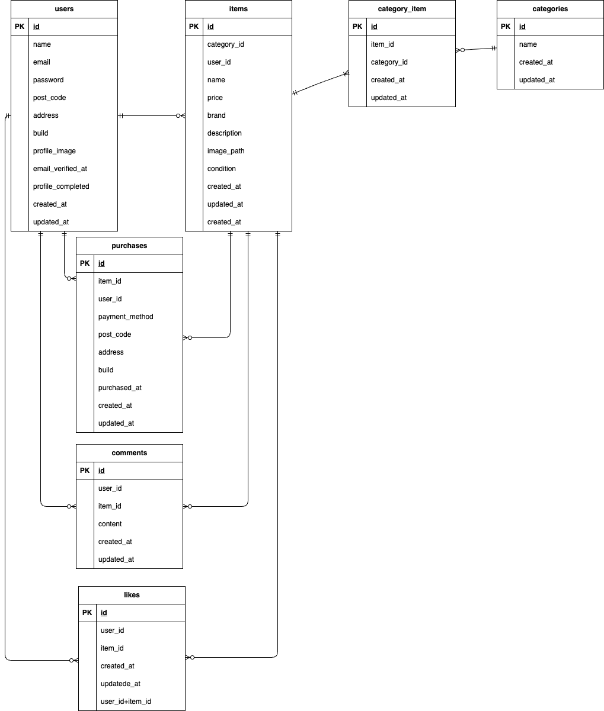

# COACHTECH(フリマサイト)※模擬案件

## 前提条件

本環境を構築するには、以下のツールが必要です。

- Git: 2.x 以上  
  確認方法: `git --version`
- Docker: 20.x 以上  
  確認方法: `docker --version`

- Docker Compose: 2.x 以上  
  確認方法: `docker compose version`

- Composer: 2.x 以上  
  確認方法: `composer -V`

- PHP: 8.1 以上（推奨 8.4.x）  
  確認方法: `php -v`

## 環境構築

**ディレクトリ構成**

```
assignment1
├── docker
│   ├── mysql
│   │   ├── data
│   │   └── my.cnf
│   ├── nginx
│   │   └── default.conf
│   └── php
│       ├── Dockerfile
│       └── php.ini
├── src
│   ├── app/
│   ├── config/
│   ├── database/
│   ├── public/
│   ├── resources/
│   ├── routes/
│   ├── storage/ ※出品画像、プロフィール画像を格納
│   └── test/
├── .env.example
├── .gitignore
├── README.md
└── docker-compose.yml


```

※src 以下のディレクトリは、主要なものに絞って記載しています。

**Docker ビルド**

1. ディレクトリ(assignment1)の作成

2. docker-compose.yml の作成

3. Nginx(default.conf) の設定
4. PHP(Dockerfile,php.ini) の設定
5. MySQL(my.cnf) の設定
6. phpMyAdmin(docker-compose.yml) の設定
7. DockerDesktop アプリを立ち上げる
8. `docker-compose up -d --build`でビルド

**Laravel 環境構築**

1. コンテナに入ります。

   ```bash
   docker　compose exec php bash
   ```

2. 依存パッケージをインストールします。

   ```bash
   composer install
   ```

3. .env.example から新しい環境設定ファイルを作成します。

   ```bash
   cp .env.example .env
   ```

4. .env に以下の環境変数を追加

   ```text
   DB_CONNECTION=mysql
   DB_HOST=mysql
   DB_PORT=3306
   DB_DATABASE=laravel_db
   DB_USERNAME=laravel_user
   DB_PASSWORD=laravel_pass
   ```

5. アプリケーションキーの作成

   ```bash
   php artisan key:generate
   ```

6. マイグレーションの実行

   ```bash
   php artisan migrate
   ```

7. シーディングの実行

   ```bash
   php artisan db:seed
   ```

8. ストレージリンクの作成

   アップロード画像を正しく参照するために以下を実行してください

   ```bash
    php artisan storage:link
   ```

## セットアップ後の確認方法

- `http://localhost/` にアクセスし、トップ画面が表示されることを確認してください。
- ログイン画面 (`http://localhost/login/`) や会員登録画面 (`http://localhost/register/`) が表示されることを確認してください。
- phpMyAdmin (`http://localhost:8080/`) に接続できることを確認してください。
- MailHog (`http://localhost:8025/`) にアクセスし、メール送信テストが確認できることを確認してください。

## テストユーザー（開発環境専用）

php artisan db:seed を実行すると、初期データが投入されます。

テストユーザーは Seeder により自動生成されます。ログイン情報は以下の通りです。

- Email: test@example.com
- Password: abab1234

  ※ 本番環境では使用しないでください

**テスト実行方法**

1. `.env.testing.example` をコピーして `.env.testing` を作成します。

   ```bash
   cp .env.testing.example .env.testing
   ```

2. 必要な環境変数を .env.testing に設定してください。

3. テスト用データベースをマイグレーションします.

   ```bash
   php artisan migrate --env=testing
   ```

4. テストを実行します。

   ```bash
   php artisan test
   ```

## よく使うコマンド

- コンテナに入る

  ```bash
   docker-compose exec php bash
  ```

- キャッシュクリア

  ```bash
    php artisan config:clear
    php artisan cache:clear
    php artisan route:clear
    php artisan view:clear
  ```

- マイグレーションリセット & シーディング

  ```bash
    php artisan migrate:fresh --seed
  ```

## 使用技術(実行環境)

- git:2.50.1
- Docker:28.4.0
- Docker compose:2.39.2
- Composer:2.9.2
- PHP:8.4.12
- Laravel:8.83.29
- nginx:1.21.1
- MySQL:8.0.26

## ER 図



## URL

- 開発環境(トップ画面)：http://localhost/
- 認証（ログイン画面）：http://localhost/login/
- 認証（会員登録画面）：http://localhost/register/
- phpMyAdmin ：http://localhost:8080/
- MailHog :http://localhost:8025/

## 補足情報

本プロジェクトでは、仕様書に明記されていない JavaScript を一部の Blade で使用しています。  
用途は UI の補助的な動作に限定しており、以下の点に留意しています。

- 認証処理 (Fortify) やバリデーション (FormRequest) には利用していません。
- その他、仕様書で特定の技術が指定済みの箇所でも JavaScript は使用していません。

### 使用箇所

- `layout.blade.php` : ハンバーガーメニューのボタン開閉
- `detail.blade.php` : 「いいね」ボタン押下時の色・カウントの変更
- `purchase.blade.php` : 支払い方法選択時の購入確認欄の表示切替え
- `sell.blade.php` : 出品商品の画像アップロード時のプレビュー表示切替え
- `edit.blade.php` : プロフィール編集画面で画像アップロード時のプレビュー表示切替え
